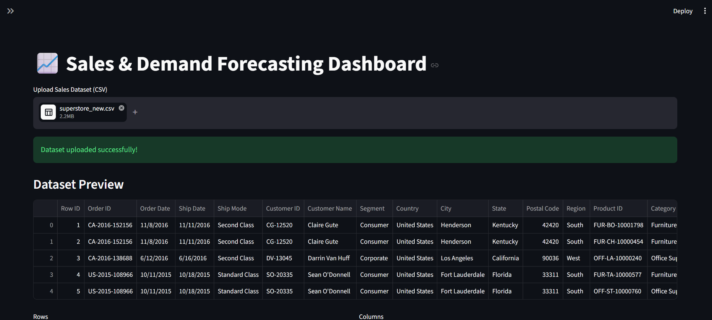
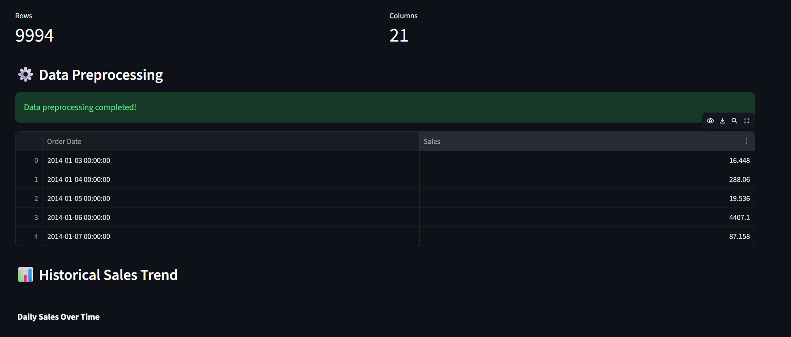
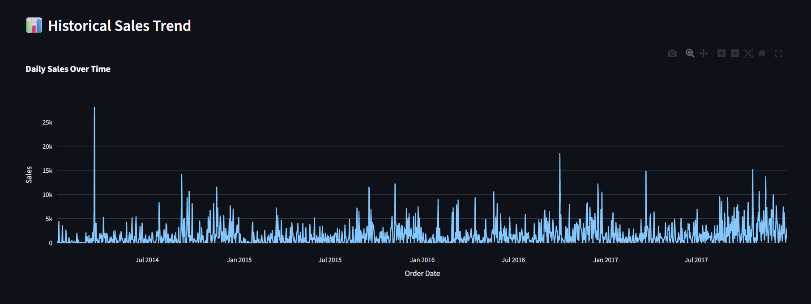
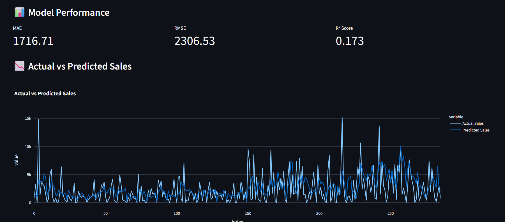
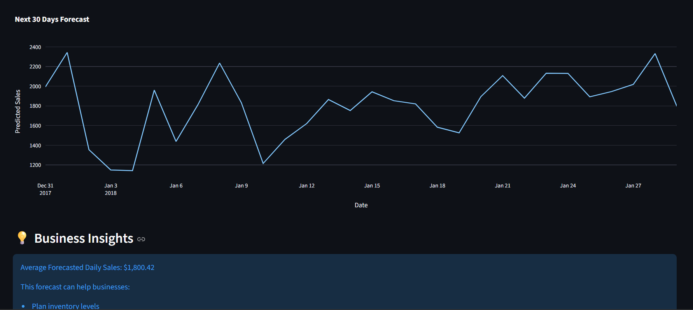

# 📈 Sales & Demand Forecasting Dashboard

## Overview

This project is an end-to-end Machine Learning application developed as part of the Future Interns ML Internship Program.

The goal is to forecast future business sales using historical sales data and provide actionable business insights through an interactive Streamlit dashboard.

The application performs:

* Data preprocessing
* Time-series feature engineering
* Machine Learning model training
* Sales forecasting
* Interactive visualizations
* Downloadable forecast reports

---

## Business Problem

Accurate sales forecasting helps businesses:

* Plan inventory efficiently
* Reduce stock shortages
* Improve cash flow management
* Optimize staffing requirements
* Support data-driven decision making

---

## Dataset

Dataset Used:

**Superstore Sales Dataset**

Features include:

* Order Date
* Sales
* Customer Information
* Product Information
* Region Information

---

## Technologies Used

* Python
* Pandas
* NumPy
* Scikit-Learn
* Streamlit
* Plotly
* Joblib

---

## Machine Learning Workflow

### 1. Data Preprocessing

* Date conversion
* Daily sales aggregation
* Missing date handling
* Continuous time-series creation

### 2. Feature Engineering

Features created:

* Year
* Month
* Day
* Weekday
* Quarter
* Lag 1
* Lag 7
* Lag 14
* Lag 30
* Rolling Mean 7
* Rolling Mean 14
* Rolling Mean 30
* Weekend Indicator

### 3. Model Training

Model Used:

Random Forest Regressor

### 4. Model Evaluation

Metrics:

* MAE (Mean Absolute Error)
* RMSE (Root Mean Squared Error)
* R² Score

### 5. Future Forecasting

Recursive forecasting is used to predict future sales for configurable forecast horizons.

---

## Streamlit Dashboard Features

* Upload Sales Dataset
* Historical Sales Visualization
* Automated Data Preprocessing
* Model Training
* Performance Metrics
* Actual vs Predicted Visualization
* Future Sales Forecasting
* Download Forecast Results

---

## Project Structure

sales-demand-forecasting/

├── app.py

├── src/

│ └── forecast_utils.py

├── data/

├── outputs/

├── notebooks/

├── requirements.txt

├── README.md

└── .gitignore

---

## How To Run

Install dependencies:

pip install -r requirements.txt

Run Streamlit:

streamlit run app.py

---

## Results

The forecasting system successfully captures overall sales trends and provides future demand estimates for business planning purposes.

---
## Application Screenshots
---
## Dashboard

---
## Data Preprocessing

---
## Historical Sales Trend

---
## Model Performance

---

## Forecast

---

## Author

Aprameya Haritasa Sharma K L

Future Interns – Machine Learning Internship Project

